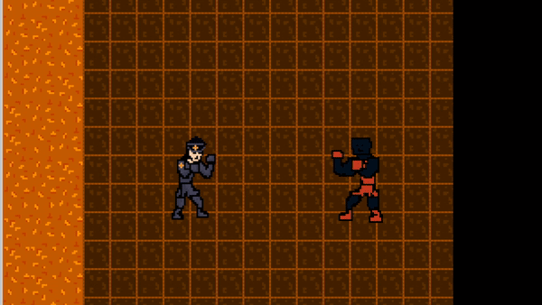

# Sprite Animation Systems

## Objetivo del Proyecto
Este proyecto se enfoca en desarrollar sistemas de animación de sprites para un motor de juegos (engine). El objetivo es que el motor pueda manejar animaciones de sprites que reaccionen a entradas del usuario o a inteligencia artificial (AI) a lo largo del tiempo.

## Características Principales
- **Motor de Juegos:** Uso del motor que han estado construyendo para dibujar y animar sprites.
- **Animación de Personajes:** Implementación de sprites animados para personajes que responden a entradas del usuario.
- **Interactividad:** El personaje puede moverse en el mundo utilizando el teclado, con la animación del sprite cambiando según la dirección y tipo de movimiento.
- **Ambiente del Juego:** Dibujo de fondos y elementos del juego con lógica relevante para la narrativa.
- **Enemigos y Elementos Animados:** Inclusión de enemigos o elementos animados en el juego.
- **Cambios en las Sprites:** Asegurarse de que las sprites cambien adecuadamente según el movimiento del personaje.

## Guía de Implementación
1. **Dibujo del Fondo:** Dibujar el fondo del juego en pantalla e implementar lógica relevante para el juego.
2. **Animación del Personaje:** Utilizar una sprite animada para el personaje principal.
3. **Sistema de Input:** Crear un sistema de entrada que permita cambiar la posición del personaje en el mundo.
4. **Elementos Animados Adicionales:** Agregar enemigos o elementos del mundo con animación.
5. **Adaptación de Sprites:** Garantizar que las sprites cambien de acuerdo con el movimiento del personaje.

## Documentación y Evidencia
- **Reflexión y Conexión Narrativa:** Incluir una reflexión sobre el proceso de implementación y cómo se conecta este sistema a la narrativa del juego.
- **Evidencia Visual:** Añadir screenshots o, preferiblemente, un gif/video que muestre la interacción con el sistema.
- **Código Fuente:** Proveer un enlace al código fuente en GitHub.
- **Trabajo en Equipo:** Si trabajan en grupo, usar el motor para implementar un personaje o enemigo adicional.

## Entrega
- **Portafolio Electrónico:** Utilizar la función de canvas de portafolios electrónicos para añadir una nueva página al portafolio del curso, incluyendo la evidencia de cómo se implementó el fondo y otros elementos del sistema.
- **Enlace en Canvas:** Entregar el enlace a su portafolio en la plataforma Canvas.

